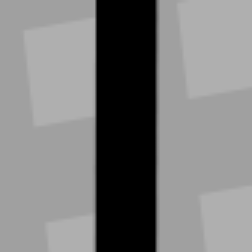
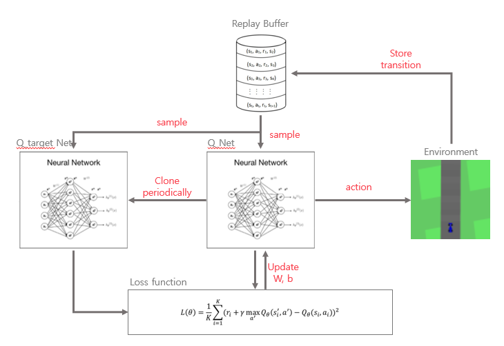

# RL_CarRacing
Reinforcement Learning으로 CarRacing을 진행합니다

---
- model path: ./models/CarRacing_DQN_8.907.pt
- Do you want to test?
    - test.py
- Do you want to train:
    - main.py
---

## CarRacing 
### 1. Environment info
- Open AI gym에서 제공하는 PyGame 및  Box2D 기반의 게임
- https://gymnasium.farama.org/environments/box2d/car_racing/
- Goal 
    - 1000 steps 안에 자동차가 모든 트랙을 지나가는 것
- action_space 
    -  Discrete(5) 
    -   [do nothing, steer left, steer right, gas, brake]
-  observation Space : 
    - Box(0, 255, (96, 96, 3), uint8)
    - 96x96 RGB image
- reward
    - 시간 : Step(frame)이 지날 때마다 -0.1
    - 트랙 : 방문한 트랙에 대해 + 1000/N (N: 방문한 트랙 수)
    - 실패 : 트랙에서 멀리 떨어진 경우: -100

### 2. data 전처리
- state : (96, 96, 3) image -> (4, 84, 84) image
-  img -> crop -> background -> grascale -> blur -> canny -> normalize
- 4 stack frame : 이동 방향 알기 위해

|img| crop|background|grascale|blur|canny |
|:---:|:---:|:---:|:---:|:---:|:---:|
||||||

### 3. Algorithm : DQN
- CNN 기반의 모델 사용

### 4. Hyperprarmeter setting
|hyperparameter|value|
|:---:|:---:|
|n_episode|2000|
|discount factor|0.98|
|batch_size|32|
|Buffer size|50000|

### 5. train result

### 6. retults

---
Reference
- [Playing Atari with Deep Reinforcement Learning](https://arxiv.org/abs/1312.5602)
- [Control CartRacing-v2 environment using DQN from scratch](https://hiddenbeginner.github.io/study-notes/contents/tutorials/2023-04-20_CartRacing-v2_DQN.html)
- [Solving OpenAI CarRacing-v0 using Image Processing](https://medium.com/@kartha.kishan/solving-openai-carracing-v0-using-image-processing-5e1005ee0cb)
- [[카카오AI리포트]강화학습 & 슈퍼마리오 part1.](https://brunch.co.kr/@kakao-it/144)
- [Applying a Deep Q Network for OpenAI’s Car Racing Game](https://towardsdatascience.com/applying-a-deep-q-network-for-openais-car-racing-game-a642daf58fc9)

